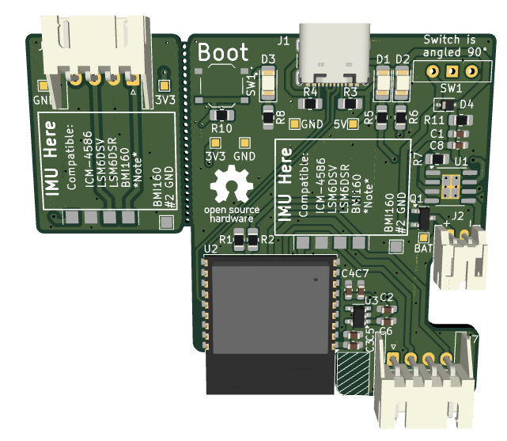
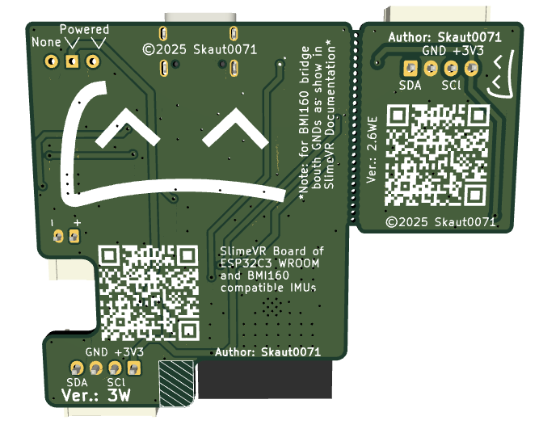

# SlimeVR DIY Project

## Overview
This is a DIY project based on the official SlimeVR documentation. The design is created for educational and hobbyist purposes.

### Visuals
<h2 align="center"><b>Front side:</b></h2>

  

<h2 align="center"><b>Back side:</b></h2>

  

## Project Information
- **KiCad Version:** 9.0
- **PCB Version:** 3W + 2.6WE (older *bigger* board files are saved if you want them *Version 0.7*, *Version 0.9* and *Version 2.5W*)

  > *W:* = Wireless
  
  > *E:* = Extension

- **Schematic Version:** 2.0
- **Project Type:** DIY/Hobby
- **Manufacture:** JLCPCB

### Hardware Specifications
- **MCU:** ESP32C3 WROOM 02
- **Supported IMU:** Any with same pin out as BMI160 module (*reference at end*)
- **Battery Management:** Integrated TP4056 charging circuit
- **Features:** Battery monitoring (Firmware), Power switch, Status LEDs

### Firmware
- *Will be available when fully tested as functional*

## Disclaimer
⚠️ **Functionality is not guaranteed.** This is an experimental project and may contain errors or issues. Use at your own risk.
- Also there can be a few grafical and speling mistakes so be aware of it.
- The images are for reference only until new version arrives, I will make new ones after

## Design Files
- PCB layout and schematic files are included in this repository
- Based on official SlimeVR documentation and specifications

## Bill of Materials (BOM)
Detailed interactive list of components:
👉 **[Open Interactive BOM (ibom.html)](https://skaut0071.github.io/SlimeVR_Tracker/PDFs/ibom)**

## Contributing
Feel free to submit issues, suggestions, or improvements via GitHub issues or pull requests.

## References
- [Official SlimeVR Documentation](https://docs.slimevr.dev/)
- [SlimeVR GitHub](https://github.com/SlimeVR)
- [BMI160 Module](https://www.aliexpress.com/item/1005006351402967.html)
